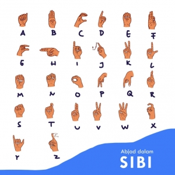

# 📘 Sign Me Up! Belajar Abjad SIBI (In Progress)

Filter edukatif-interaktif berbasis pelacakan tangan untuk mengenalkan abjad dasar **Sistem Isyarat Bahasa Indonesia (SIBI)**, menggunakan teknologi **MediaPipe** dan dikembangkan dengan **Python**.

---

## 👥 Kelompok IF4021

| No | Nama                          | NIM         |
|----|-------------------------------|-------------|
| 1  | Shintya Ayu Wardani          | 122140138   |
| 2  | Ayu Jannati Ali Putri        | 122140201   |
| 3  | Sikah Nubuahtul Ilmi         | 122140208   |

---

## 📌 Deskripsi Proyek

**Sign Me Up!** bertujuan untuk membantu masyarakat, khususnya pemula, dalam mempelajari huruf-huruf dasar bahasa isyarat Indonesia (SIBI) dengan cara yang interaktif dan menyenangkan.

Saat aplikasi berjalan, pengguna akan diarahkan untuk menirukan satu per satu gesture huruf yang ditampilkan. Jika berhasil menirukan dengan benar, maka portal virtual terbuka, menandai kemajuan pengguna ke huruf berikutnya.

### 🎯 Inspirasi

Inspirasi dari proyek ini berasal dari:

- [Artikel Edukasi Isyarat](https://proceeding.unpkediri.ac.id/index.php/stains/article/view/4337)
- [TikTok Filter Edukatif](https://vt.tiktok.com/ZSrv5hWwt/)

---

## 🖼️ Contoh Abjad SIBI

Berikut adalah contoh gambar dari abjad dalam Sistem Isyarat Bahasa Indonesia (SIBI):



> Gambar ini akan digunakan sebagai referensi visual saat menampilkan instruksi kepada pengguna.

---

## 🚀 Cara Menjalankan

### 1. Instalasi Requirements

Pastikan Python 3.7 atau lebih tinggi telah terpasang. Jalankan perintah berikut di terminal:

```bash
pip install -r requirements.txt
````

### 2. Jalankan Program

```bash
python main.py
```

> Tekan `Q` untuk keluar dari aplikasi.

---

## 📂 Struktur Folder

```
sign-me-up/
├── main.py 
├── hand_gesture_detector.py
├── sibi_mapping.py
├── utils.py
├── requirements.txt
├── README.md
└── abjad_sibi.jpg
```

---

## 🛠 Status Pengembangan

- ✅ Desain Awal
- 🔄 Implementasi Deteksi Gesture (In Progress)
- 🔜 Integrasi TikTok Effect House (In Planning)
- 📘 Finalisasi & Dokumentasi
